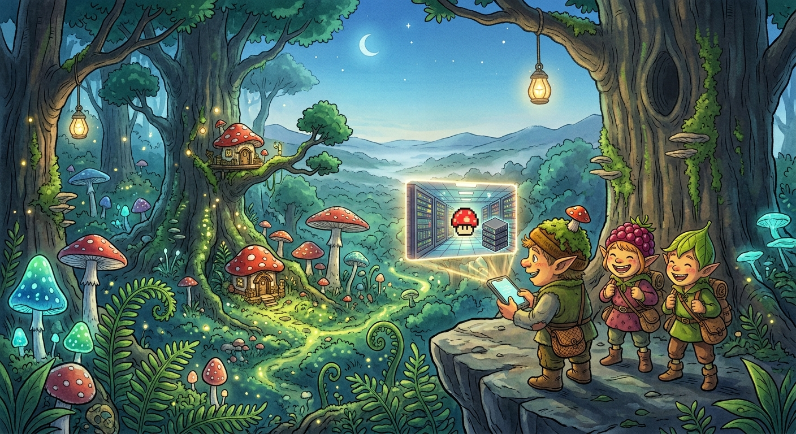
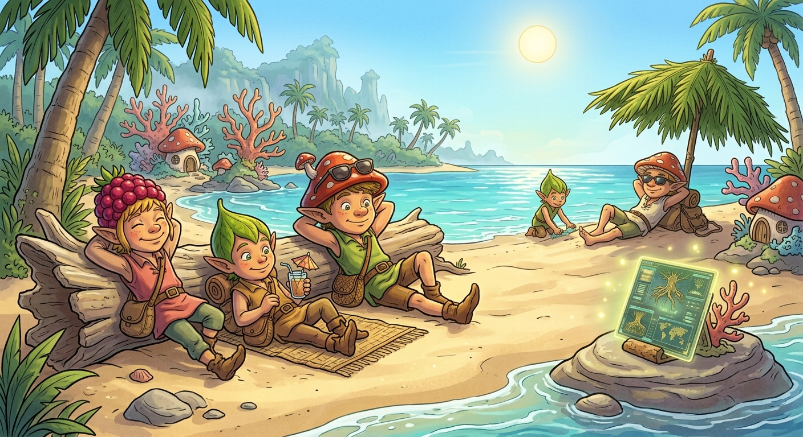
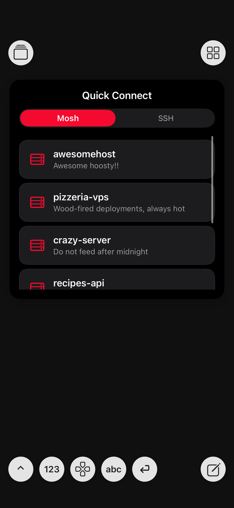
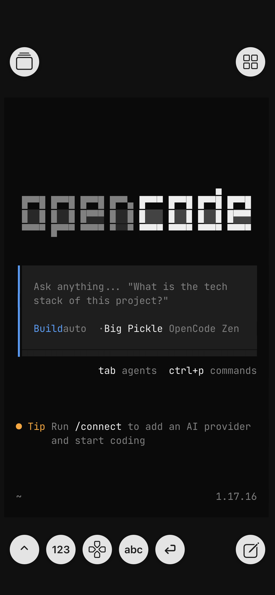
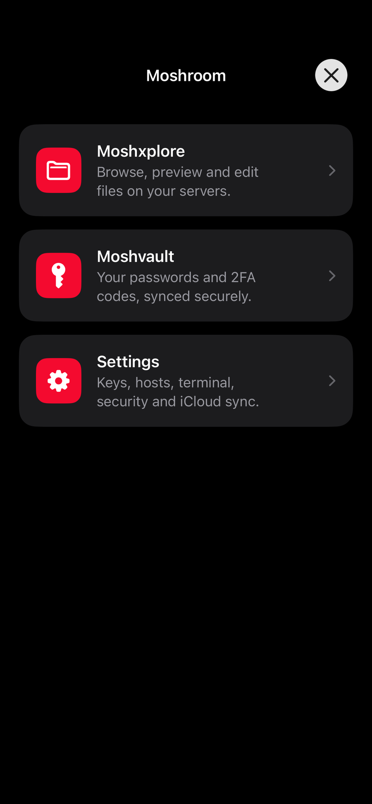
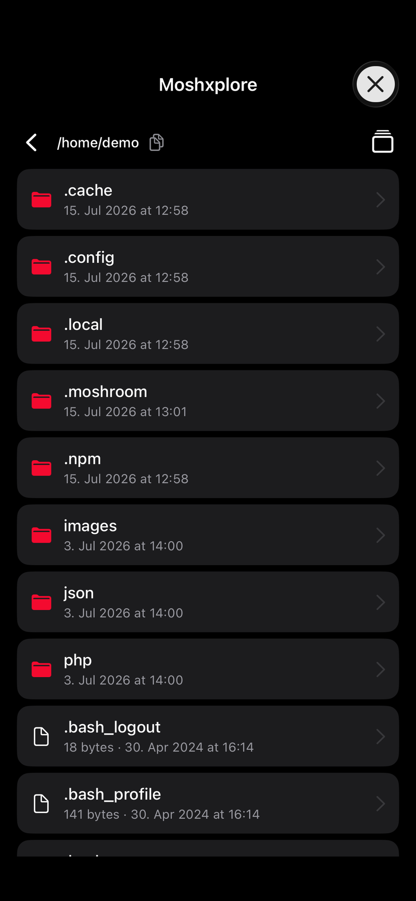
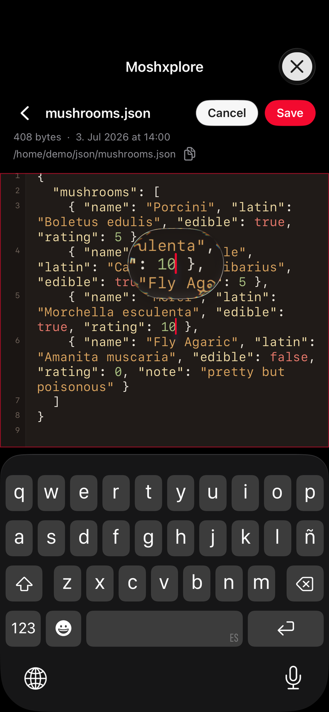
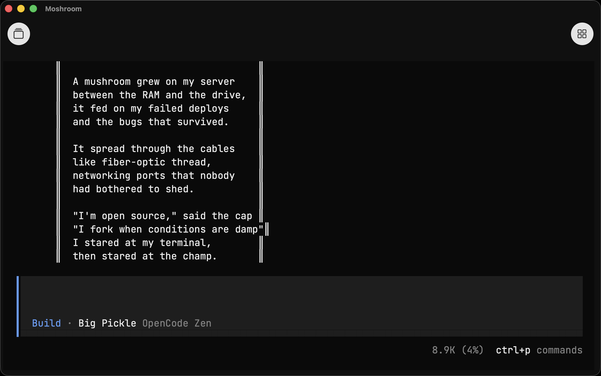
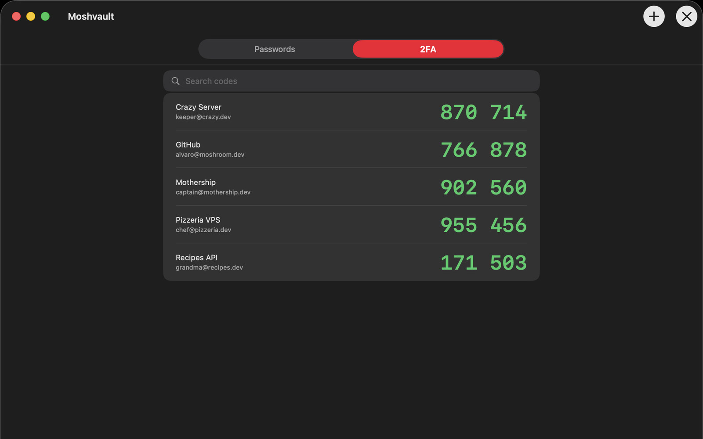
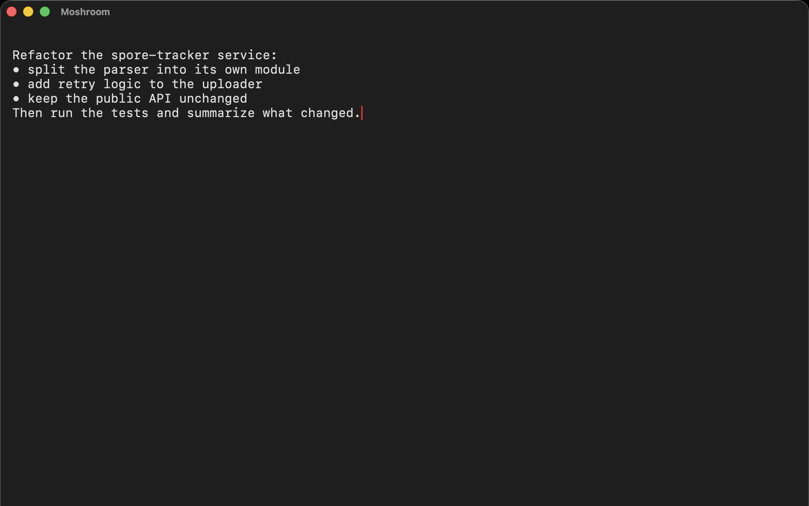

# 🍄 Moshroom

**One terminal for everything you run.** iPhone, iPad, Mac. Free and open source.

### [⬇ Get it on the App Store](https://apps.apple.com/app/moshroom/id6785947810) · [moshroom.app](https://moshroom.app)

Your machines live where the horsepower is: a VPS, a home server, the workstation back at the
office. Moshroom is the one calm cockpit you reach them all from, over **SSH or Mosh**, on every
screen you own. Connect, edit files, drive a coding agent, or fire off a quick command, and keep
your hosts, keys, snippets, passwords and 2FA codes in sync across all of it.

---

## Once upon a mushroom… 🍄

Three [Magikitos](https://magikitos.com/en/stories) had Very Important Work waiting on a server far
across the cloud. One tap in Moshroom (a saved host, SSH or Mosh) and they were *in*, steering their
agent from a moonlit cliff.



No desk, no problem. They roamed the glowing forest and briefed the agent from a mossy tree-branch
bridge, the whole toolkit riding along in one hand.


By sunrise they'd earned a break: cocktails on the beach while Moshroom kept the agent grinding away
on a rock by the sea. **The whole setup, wherever they are.** Even the Magikitos figured it out.



---

## Real talk: most terminals treat your phone like a tiny desktop

They're all the same sad combo: a thumb-sized keyboard bolted under a wall of scrollback. Great for a
cheeky `git pull` while you wait for the bus. Absolute misery the second you need to write more than a
line, and then go hunting for the typo hiding in paragraph two like it owes you rent.

Here's the trick Moshroom pulls: **it rips the terminal in half.**

- The terminal goes **read-only**. It's just the transcript, so scroll it, read it, breathe. No cursor
  doing parkour, no `rm -rf` because your thumb sneezed.
- Everything you **send** goes through UI that was actually designed for a slab of glass you hold in
  one hand on a moving train, or a full keyboard and mouse at the desk.

Two jobs, two tools. Revolutionary, we know. 🙄

---

## The good stuff

🔌 **Moshnector**: land on a fresh shell and boom, a connect card is already sitting there. Tap SSH
or Mosh, tap a saved host, done. Moshroom types the line so your thumbs don't have to.

✍️ **Moshkitor**: a full-screen composer with room to *think*. Write the long prompt. Dictate it if
your thumbs are tired. Scroll back and fix that word. Ride the live command and snippet autocomplete.
Auto bullet lists like it's the Notes app. Close it by accident? Your draft is still there. Fire it off
with a tap or `Ctrl+Enter`.

⌨️ **Moshkeys**: floating round keys that punch **live** into a program or your TUI: `Esc`, `Tab`,
`Ctrl-C`, and a `↕` that flips the bar into a proper **arrow-key mode** so you can nudge around
vim or htop without menu-diving. Plus a specials pad, digits, letters, Enter, and a compose button.

📎 **Moshdrop**: attach a photo, a PDF, a gnarly log, any text or code file. It drops **inline right
at your cursor**. Hit send and Moshroom SFTPs it to your box and swaps the chip for its real path, so
the agent reads it exactly where you meant it. Photos get downscaled and re-encoded on the phone
first, so uploads stay featherweight. Your server needs nothing installed. Nada.

🗂️ **Moshxplore**: a remote file browser that runs over any tab, no shell needed. Pick a host, walk
its folders (real SFTP, not screen-scraped `ls`), preview images and code with syntax highlighting,
edit a config in place, and yoink files straight into your Files app or Finder. It's `scp`, minus the
part where you type `scp`.

🔐 **Moshvault**: your passwords and 2FA codes, right where you connect. Live TOTP codes tick over in
green, bring your existing accounts over from a Google Authenticator export, and the whole vault rides
your **end-to-end-encrypted iCloud Keychain**. On every device, readable by no one but you.

🚀 **Command on connect**: set a per-host one-liner (`cd wherever && opencode`) and Moshroom runs it
*inside* the session the moment you land, SSH or Mosh, and it plays nice with your `tmux attach` or
`screen -r` instead of stomping on it.

📋 **Copy, elegantly**: long-press a word on iPhone, drag or double-click with the mouse on Mac.
Always in Moshroom red, always one clean Copy. Programs can push text straight to your clipboard over
OSC 52, even from deep inside a full-screen TUI.

🧩 **Snips + iCloud sync**: stash the incantations you retype a hundred times a day and drop them into
the composer in a tap. **iCloud sync** keeps your hosts and snips in step across your devices (off by
default, because it's your data). Keys and passwords ride the **iCloud Keychain**, end-to-end
encrypted.

📑 **Tabs**: run a whole pile of sessions at once (an agent here, a `tail -f` there, vim in a third)
and hop between them with a tap. Each tab **names itself** after the host it's connected to, so you
always know which is which. Long-press to rename any of them your way.

---

## See it in action 📸

Real screenshots, real sessions, one thumb.

<table>
  <tr>
    <td width="220" align="center"></td>
    <td><b>🔌 Land connected</b><br><br>Every fresh shell greets you with a connect card. Pick Mosh or SSH, tap a saved host, and Moshroom types the line for you. You're in before you've put your coffee down.</td>
  </tr>
  <tr>
    <td align="center"></td>
    <td><b>🤖 Drive your agent</b><br><br>The terminal is a calm, read-only transcript. Kick off a coding agent, read what it does, and scroll back through the whole session without a stray thumb firing anything.</td>
  </tr>
  <tr>
    <td align="center"></td>
    <td><b>🍄 One hub</b><br><br>Files, vault, and settings, one tap from the terminal. Everything the app can do lives behind a single launcher.</td>
  </tr>
  <tr>
    <td align="center"></td>
    <td><b>🗂️ Moshxplore</b><br><br>Walk a host's folders over real SFTP, peek at images and code inline, and pull files straight into the Files app. No shell required.</td>
  </tr>
  <tr>
    <td align="center"></td>
    <td><b>✏️ Edit in place</b><br><br>Open a remote config, edit it right there with syntax highlighting, and save it back over SFTP. No download-edit-reupload dance.</td>
  </tr>
</table>

### On the Mac, too

The exact same cockpit, one purchase, every screen. Start a session on the sofa from your iPhone, sit
down at the Mac, and your hosts are already there, one click away.



<table>
  <tr>
    <td width="50%" align="center"><br><b>🔐 Moshvault</b><br>Passwords and live 2FA codes, in the same app, synced and encrypted.</td>
    <td width="50%" align="center"><br><b>✍️ Write, don't fight</b><br>A real composer for the long brief, then send with a keystroke.</td>
  </tr>
</table>

---

## Get it

**On the App Store:** [Get Moshroom for iPhone, iPad and Mac](https://apps.apple.com/app/moshroom/id6785947810).
One purchase covers all three (iOS 16.1+, macOS 13+ on Apple silicon). Your server needs nothing
installed: Moshroom talks plain SSH and Mosh, with no daemon and no agent-side setup.

**Or build it yourself.** You'll want an **iPhone or iPad on iOS/iPadOS 16.1+** (or a **Mac with
Apple silicon on macOS 13+**) with Developer Mode on, the full **Xcode.app**, and an Apple signing
team. Then:

```bash
./get_frameworks.sh                                   # self-hosted binary frameworks (see FRAMEWORKS.md)
cp template_setup.xcconfig developer_setup.xcconfig   # fill in TEAM_ID + your bundle/group/cloud/keychain ids
./deploy.sh                                            # build, install & launch on the plugged-in device
```

First build is slow (grab a coffee ☕), the rest are incremental. Every binary framework it links
(mosh, the SSH stack, crypto, ios_system) is **self-hosted on this repo's own release** and slimmed
down to just the device slices it needs. Zero third-party hosting, zero surprises. The full breakdown
lives in [`FRAMEWORKS.md`](FRAMEWORKS.md).

---

## License

Free software under the **GNU GPL v3**, see [`COPYING`](COPYING). Study it, hack it, ship it, break it,
fix it. Bundled third-party bits (Mosh, libssh2, the fonts, and friends) keep their own licenses, called
out in their headers and in the app's About screen. Go build something. 🍄

**App Store distribution:** as sole copyright holder of Moshroom's own code, Alvaro Franz additionally
grants permission to distribute this application through Apple's App Store, notwithstanding the App
Store terms. This is an additional permission under GPLv3 §7. The bundled Mosh is covered by its own
iOS/App-Store waiver (`COPYING.iOS`); every other bundled component is under a permissive license.
