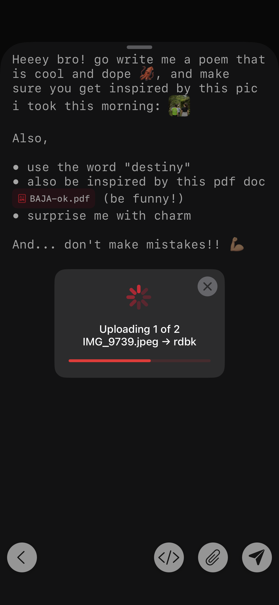
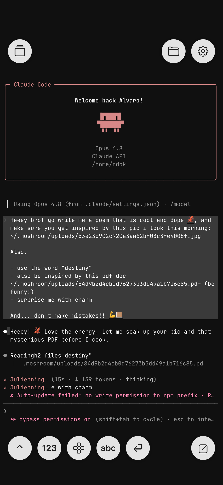
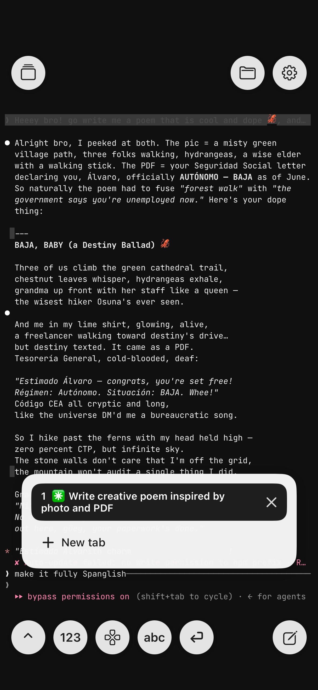
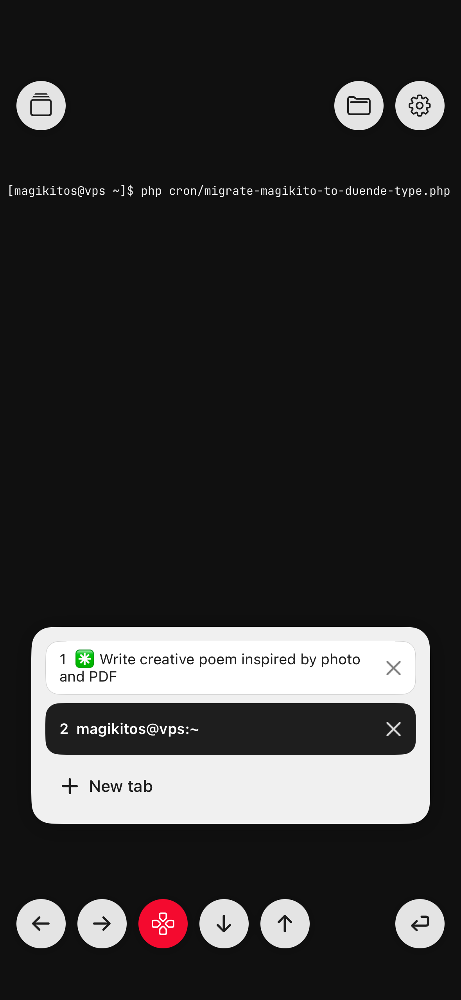
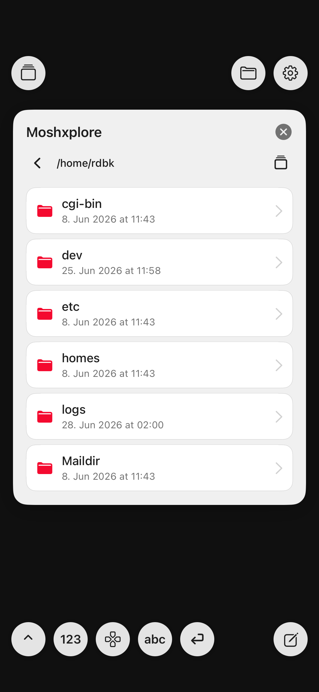

# 🍄 Moshroom

**Rule your agents from anywhere. Simple. Awesome. Free.**

Your agent lives where the horsepower is — your VPS, a home server, whatever box has the muscle.
Moshroom is the remote you grab to steer it from the sofa, over **SSH or Mosh**, without wanting to
launch the thing into orbit halfway through.

---

## Real talk: every mobile terminal sucks at this

They're all the same sad combo — a thumb-sized keyboard bolted under a wall of scrollback. Great for a
cheeky `git pull` while you wait for the bus. Absolute misery the second you need to brief an agent with
three actual paragraphs of thought... and then go hunting for the typo hiding in paragraph two like it
owes you rent.

Here's the trick Moshroom pulls: **it rips the terminal in half.**

- The terminal goes **read-only**. It's just the transcript — scroll it, read it, breathe. No cursor
  doing parkour, no `rm -rf` because your thumb sneezed.
- Everything you **send** goes through UI that was actually designed for a slab of glass you hold in
  one hand on a moving train.

Two jobs, two tools. Revolutionary, we know. 🙄

---

## The good stuff

🔌 **Moshnector** — land on a fresh shell and boom, a connect card's already sitting there. Tap SSH or
Mosh, tap a saved host, done. Moshroom types the line so your thumbs don't have to.

✍️ **Moshkitor** — a full-screen composer with room to *think*. Write the long prompt. Dictate it if
your thumbs are tired. Scroll back and fix that word. Ride the live command + snippet autocomplete.
Auto bullet lists like it's the Notes app. Close it by accident? Your draft's still there. Fire it off
with a tap or `Ctrl+Enter`.

⌨️ **Moshkeys** — floating round keys that punch **live** into the agent or your TUI: `Esc`, `Tab`,
`Ctrl-C`, and a `↕` that flips the bar into a proper **arrow-key mode** (`← → ↕ ↓ ↑`) so you can nudge
around vim/htop without menu-diving. Plus a specials pad, digits, letters, Enter, and a compose button.

📎 **Moshdrop** — attach a photo, a PDF, a gnarly log, any text/code file — it drops **inline right at
your cursor**. Hit send and Moshroom SFTPs it to `~/.moshroom/uploads/` on your box and swaps the chip
for its real path, so the agent reads it exactly where you meant it. Photos get downscaled + re-encoded
to JPEG **on the phone first** (HEIC too), so uploads stay featherweight and land in something any
vision model can actually open. Your server? Needs nothing installed. Nada.

🗂️ **Moshxplore** — a remote file browser that runs over any tab, no shell needed. Pick a host, walk
its folders (name, size, date — real SFTP, not screen-scraped `ls`), peek at images and text/code
inline, and yoink files straight into your Files under **Moshroom › host › file**. It's
`scp`, minus the part where you type `scp`.

🚀 **Command on connect** — set a per-host one-liner (`cd wherever && opencode --yolo`) and Moshroom runs it *inside*
the session the moment you land — SSH or Mosh, and it plays nice with your `tmux attach` / `screen -r`
instead of stomping on it.

📋 **Tap-to-copy** — long-press any word to grab it. Agents and apps can shove text straight to your iOS
clipboard over OSC 52, even from deep inside a full-screen TUI. Copy-paste that just *works*, imagine.

🧩 **Snips** — stash the incantations you retype a hundred times a day, drop them into the composer in a
tap. And **iCloud Drive sync** keeps your hosts + snips in step across your devices (off by default,
because it's your data). Your SSH keys and passwords live in the **iCloud Keychain** — end-to-end
encrypted, they survive reinstalls and follow your devices without you lifting a finger.

📑 **Tabs** — run a whole pile of sessions at once (an agent here, a `tail -f` there, vim in a third) and
hop between them with a tap. Each tab **names itself** from whatever's running — the host, the agent's
current task — so you actually know which is which. Long-press to rename any of them your way.

---

## See it in action 📸

Real screenshots, real agent, one thumb.

<table>
  <tr>
    <td width="240" align="center"></td>
    <td><b>✍️📎 Moshkitor + Moshdrop</b><br><br>Write the long prompt in a real composer, drop a photo <em>and</em> a PDF inline right where the cursor sits, then watch them SFTP up to your box on send. Bullet lists, dictation, drafts that survive a mis-tap — the works.</td>
  </tr>
  <tr>
    <td align="center"></td>
    <td><b>🤖 Drive your agent</b><br><br>The terminal is a calm, read-only transcript. Here's the agent picking up the prompt &mdash; your attachments already swapped for real <code>~/.moshroom/uploads/&hellip;</code> paths it can actually open and read.</td>
  </tr>
  <tr>
    <td align="center"></td>
    <td><b>📜 Read, scroll, juggle tabs</b><br><br>The agent cooks; you just read and scroll &mdash; no cursor doing parkour, no <code>rm</code> because your thumb sneezed. Multiple live sessions sit side by side in the Tabs pad, one tap to hop between them.</td>
  </tr>
  <tr>
    <td align="center"></td>
    <td><b>⌨️ Moshkeys</b><br><br>Floating round keys that punch straight into the TUI. Flip the bar into arrow-key mode (<code>&larr; &rarr; &darr; &uarr;</code>) to nudge around vim/htop, with Enter parked bottom-right so you fire and drop back in one tap.</td>
  </tr>
  <tr>
    <td align="center"></td>
    <td><b>🗂️ Moshxplore</b><br><br>A remote file browser that runs over any tab &mdash; walk the folders, peek at images and code inline, and yank files straight into your Files app. It's <code>scp</code>, minus the part where you type <code>scp</code>.</td>
  </tr>
</table>

---

## Get it on your phone (or iPad)

Moshroom is **one universal app** — same binary, iPhone *and* iPad. On the iPad it doesn't just stretch
a phone layout: it uses the canvas. The composer, Settings, the file browser and the tab manager all go
**full-screen**; only the connect card and the floating keys hover over the terminal. Same brain, way
more room to boss your agent around from the sofa.

Grabbing it is a build-it-yourself job for now (it's [headed to the App Store](https://moshroom.app) —
watch that space). You'll want an **iPhone or iPad on iOS/iPadOS 16.1+** with Developer Mode on, the
full **Xcode.app**, and an Apple signing team. Then:

```bash
./get_frameworks.sh                                   # self-hosted binary frameworks (see FRAMEWORKS.md)
cp template_setup.xcconfig developer_setup.xcconfig   # fill in TEAM_ID + your bundle/group/cloud/keychain ids
./deploy.sh                                            # build, install & launch on the plugged-in device
```

First build is slow (grab a coffee ☕), the rest are incremental. Every binary framework it links —
mosh, the SSH stack, crypto, ios_system — is **self-hosted on this repo's own release** and slimmed down
to just the iOS-device slice (886 MB of junk → 104 MB of the stuff that runs). Zero third-party hosting,
zero surprises. The full breakdown lives in [`FRAMEWORKS.md`](FRAMEWORKS.md).

---

## License

Free software under the **GNU GPL v3** — see [`COPYING`](COPYING). Study it, hack it, ship it, break it,
fix it. Bundled third-party bits (Mosh, libssh2, the fonts, and friends) keep their own licenses, called
out in their headers and in the app's About screen. Go build something. 🍄

**App Store distribution:** as sole copyright holder of Moshroom's own code, Alvaro Franz additionally
grants permission to distribute this application through Apple's App Store, notwithstanding the App
Store terms — an additional permission under GPLv3 §7. The bundled Mosh is covered by its own
iOS/App-Store waiver (`COPYING.iOS`); every other bundled component is under a permissive license.
